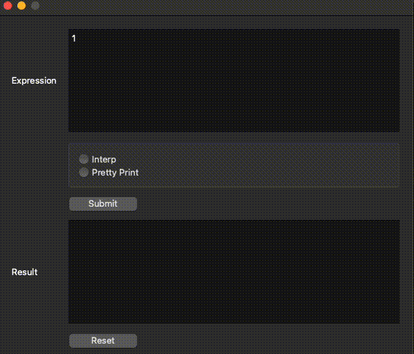

## MSDscript

C++ Scripting Language Interpreter

## Purpose

*  Learn the inner workings of scripting languages like Python
* Designed for GitHub Test Automation
* Utilize  the Qt framework for creating user-friendly interfaces

## Demo



## **Key Features**

- **Grammar Rules Parsing**: MSDscript parses input based on specified grammar rules, such as:

  ```c++
  <expr> = <number>
         | <expr> + <expr>
         | <expr> * <expr>
         | <variable>
  ```

- **Mathematical Expression Support**: Supports mathematical expressions following BODMAS rules, including Brackets, Multiplication, Addition, and Subtraction. It adheres to the precedence rules:

  - Example: `1 + 4 interps 6`
  - Example: `(2 * 20) + 1 interps to 41 `

- **Let Binding and Functions**: MSDscript allows for let binding and defining functions. For example:

  ```c++
  5 * (_let x = 5
       _in  x) + 1
  ```

  ```c++
  _let factrl = _fun (factrl)
                  _fun (x)
                    _if x == 1
                    _then 1
                    _else x * factrl(factrl)(x + -1)
  _in  factrl(factrl)(10)
  ```

- **Booleans and Conditions**: MSDscript supports booleans and conditional statements. For example:

  ```
  _let same = 1 == 2
  _in  _if 1 == 2
       _then _false + 5
       _else 88
  ```

  MSDscript handles exceptions. For example, interpreting the following expression should raise an exception because 5 is not a boolean:

  ```c++
  _if 4 + 1
  _then 2
  _else 3
  ```

- **Additional Examples**:

  - `1==2+3` interprets as `_false`
  - `(1==2)+3` interprets with an error message: "Adding non-numbers"
  - `1+1 == 2+0` evaluates to `_true`

## MSDscript UI

The MSDscript interpreter includes a user-friendly graphical user interface (UI) developed with Qt, enhancing the overall user experience.

 The UI offers the following key features:

- **Expression**: Provides a text view where users can easily write and input expressions.
- **Interp Button**: Includes  "Interpret" button for executing the entered expression.
- **Pretty Print Button**: Offers a "Print" button feature for displaying the interpreted result.
- **Resut**: Provide a text view where user can see their interpretation and prints. 
- **Reset**: Includes a "Reset" feature that allows users to clear both the entered expression and any selected radio buttons.
